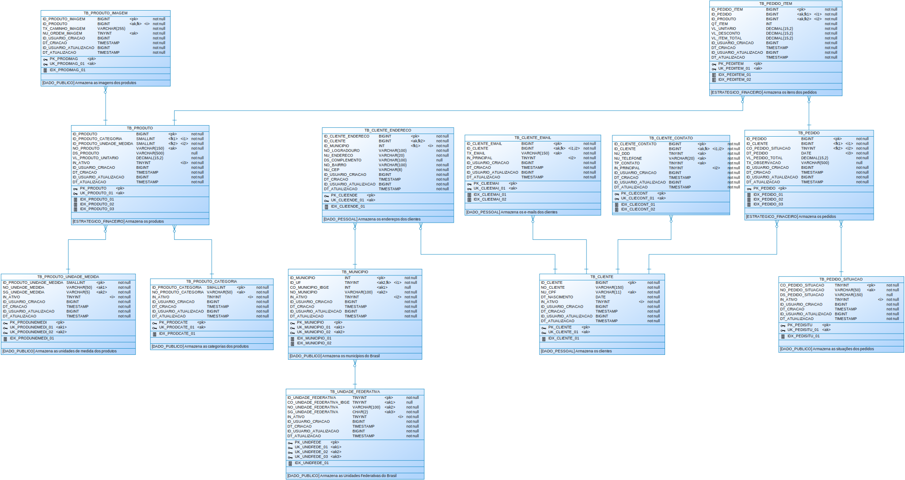

# Resposta ao Desafio Técnico - Processo Seletivo

Este documento apresenta a solução proposta para o desafio técnico, abordando modelagem de dados, SQL avançado com procedures, otimização de consultas e práticas seguras 
para migrações entre ambientes.

## Parte 1 — Modelagem de Dados

### 1.1. Padrão de Nomenclatura

#### 1.1.1. Objetos
| TIPO                 | DESCRIÇÃO RESUMIDA                                                                 | PREFIXO                    | EXEMPLO                 |
|----------------------|------------------------------------------------------------------------------------|----------------------------|-------------------------|
| Tabela Relacional    | Tabela principal que representa uma entidade de negócio                           | `TB_`                      | `TB_CLIENTE`            |
| Tabela Auditoria     | Armazena trilhas de alterações realizadas nas tabelas principais                  | `TB_AUD_`                  | `TB_AUD_CLIENTE`        |
| Tabela Histórica     | Guarda versões anteriores dos registros para fins de histórico                    | `TH_`                      | `TH_PEDIDO`             |
| Coluna               | Campo de uma tabela, com nome padronizado por prefixo                             | `*`                        | `CO_MUNICIPIO_IBGE`     |
| Índice               | Melhora a performance de busca nas tabelas                                        | `IDX_<alias_tabela>_<seq>` | `IDX_CLIENTE_01`        |
| Visão (View)         | Consulta pré-definida que representa uma visão lógica dos dados                   | `VW_`                      | `VW_PRODUTOS_ATIVO`     |
| Sequência            | Gerador de valores automáticos para campos identificadores                        | `SEQ__<alias_tabela>`      | `SEQ_CLIENTE`           |
| Procedure            | Procedimento armazenado que executa lógica no banco de dados                      | `PRC_`                     | `PRC_INSERIR_PEDIDO`    |
| Function             | Função armazenada que retorna valor único                                         | `FNC_`                     | `FNC_CALCULAR_DESCONTO` |
| Tipo (Domínio)       | Representa domínios fixos usados como enums no banco                              | `TPO_`                     | `TPO_STATUS_PEDIDO`     |
| Package              | Agrupamento de procedures e functions com responsabilidade comum                  | `PKG_`                     | `PKG_UTILS_GERAL`       |
| Trigger              | Dispara ações automáticas em eventos de INSERT, UPDATE ou DELETE                  | `TG_`                      | `TG_AUDIT_PEDIDO`       |

>**Obs**: Sobre o alias da tabela, utilizamos a seguinte regra de padronização:
>  1. Se o nome da tabela for simples, utiliza-se o próprio nome como alias (ex: tb_cliente → cliente). 
>  2. Se o nome da tabela for composto, utiliza-se a concatenação dos 4 primeiros caracteres de cada palavra (ex: tb_pedido_produto → pedprod).
   
#### 1 1.2. Colunas

| TIPO                | DESCRIÇÃO RESUMIDA                                    | PREFIXO | TIPO DE DADO            | EXEMPLO             |
|---------------------|-------------------------------------------------------|---------|-------------------------|---------------------|
| Identificador       | Número sequencial único, sem significado              | `ID_`   | NUMÉRICO                | `ID_CLIENTE`        |
| Código              | Código com significado, alfanumérico ou numérico      | `CO_`   | ALFANUMÉRICO / NUMÉRICO | `CO_MUNICIPIO_IBGE` |
| Nome                | Nome da entidade                                      | `NO_`   | ALFANUMÉRICO            | `NO_PRODUTO`        |
| Sigla               | Sigla da entidade                                     | `SG_`   | ALFANUMÉRICO            | `SG_UF`             |
| Descrição           | Texto descritivo                                      | `DS_`   | ALFANUMÉRICO            | `DS_PRODUTO`        |
| Texto               | Texto livre, senha, email e caminho físico do arquivo | `TX_`   | ALFANUMÉRICO            | `TX_EMAIL`          |
| Booleano            | Flag 0 ou 1 (falso ou verdadeiro)                     | `IN_`   | NUMÉRICO (0 ou 1)       | `IN_ATIVO`          |
| Tipo (status)       | Estado ou tipo com poucos valores                     | `TP_`   | NUMÉRICO                | `TP_STATUS`         |
| Número (não aritm.) | Número para identificação, sem cálculo                | `NU_`   | NUMÉRICO                | `NU_DOCUMENTO`      |
| Quantidade          | Número inteiro para contagem                          | `QT_`   | NUMÉRICO                | `QT_ITEM`           |
| Valor               | Número decimal para valores                           | `VL_`   | DECIMAL                 | `VL_PRECO`          |
| Percentual          | Percentual do desconto                                | `PC`    | DECIMAL                 | `PC_DESCONTO`       |
| Data e Hora         | Data e hora (DD/MM/AAAA HH:MM:SS)                     | `DT_`   | DATA                    | `DT_CRIACAO`        |
| Hora                | Hora (HH:MM:SS)                                       | `HR_`   | HORA                    | `HR_INICIO`         |
| Mídia               | Arquivo de mídia (imagem, áudio, vídeo)               | `MD_`   | BLOB                    | `MD_FOTO`           |
| Documento           | Dados JSON ou similares                               | `DC_`   | JSON / CLOB             | `DC_JSON`           |
 
#### 1.1.3. Restrições

| TIPO                                    | DESCRIÇÃO RESUMIDA                                 | EXEMPLO               |
|-----------------------------------------|----------------------------------------------------|-----------------------|
| Chave primária                          | `pk_<alias_tabela>`                                | `PK_CLIENTE`          |
| Chave estrangeira (normal)              | `fk_<alias_tabela_origem>_<alias_tabela_destino>`  | `FK_CLIENTE_PEDIDO`   |
| Chave estrangeira (auto-relacionamento) | `fk_<alias_tabela>_<nome_do_atributo_filho>`       | `FK_PESSOA_GERENTE`   |
| Chave estrangeira (multichave)          | `fk_<alias(<tabela_pai>_<coluna>)>_<tabela_filha>` | `FK_USUAINCL_CLIENTE` |
| Chave unica                             | `uk_<alias_tabela>_<seq>`                          | `UK_CLIENTE_01`       |
| Check                                   | `ck_<alias_tabela>_<seq>`                          | `CK_CLIENTE_01`       |

#### 1.1.4. Classificação do Dado

| TIPO                    | DESCRIÇÃO RESUMIDA                                                                         | PREFIXO                     | EXEMPLO              |
|-------------------------|--------------------------------------------------------------------------------------------|-----------------------------|----------------------|
| Dado Público            | Dado acessível ao público geral, sem restrições legais                                     | `[DADO_PUBLICO]`            | `NO_MUNICIPIO`       |
| Dado Privado            | Dado protegido por leis de privacidade (LGPD), incluindo dados sensíveis e sigilo bancário | `[DADO_PRIVADO]`            | `NU_CPF`, `VL_RENDA` |
| Estratégico Operacional | Dado usado para apoio à operação e tomada de decisão no dia a dia do negócio               | `[ESTRATEGICO_OPERACIONAL]` | `QT_ITEm_PEDIDO`     |
| Estratégico Financeiro  | Dado voltado a análises e decisões financeiras e contábeis                                 | `[ESTRATEGICO_FINANCEIRO]`  | `VL_FATURAMENTO`     |

### 1.2. Diagrama do Modelo

### 1. 3. Execução e criação do banco

- Os scripts para criação do banco estão disponíveis na pasta: [`(boacompra/migration/`](boacompra/migration/)
- Um arquivo `docker-compose.yml` foi criado para facilitar a configuração do ambiente com o banco de dados. 
- Para executar o projeto, instale o [**Docker Compose**](https://docs.docker.com/desktop/) na sua máquina e utilize o seguinte comando:
    ~~~bash
    docker-compose up mysql flyway
    ~~~
- Aguarde até o Flyway terminar de aplicar as migrações e, em seguida, execute o comando abaixo para carregar as tabelas:
    ~~~bash
    docker-compose up boacompra-carga
    ~~~
- Após o container subir e toda a estrutura estar criada, utilize seu cliente de acesso ao banco de dados com as seguintes credenciais:
  ~~~bash
  host: localhost
  porta: 3306
  usuario: boacompra_adm
  senha: K&dTsfiI2],0K2/!
  ~~~

## Parte 2 — SQL Avançado e Procedimentos Armazenados

- Foi criado o procedimento armazenado `boacompra_adm.prc_relatorio_venda_periodo`, responsável por retornar as seguintes informações:
  1. Total de pedidos no período;
  2. Soma e média dos valores dos pedidos;
  3. Lista de produtos e suas respectivas quantidades, filtrados por uma categoria específica.
- O código do procedimento está disponível no arquivo: [`boacompra/migration/ddl/V015_0__CREATE_PROCEDURE_RELATORIO_VENDA_PERIODO.sql`](boacompra/migration/ddl/V015_0__CREATE_PROCEDURE_RELATORIO_VENDA_PERIODO.sql) 
- Para executar, acesse o banco e execute:
  ~~~mysql
  USE boacompra_adm;
  CALL boacompra_adm.prc_relatorio_venda_periodo('2025-01-01', '2025-05-31', 'Eletrônicos', @relatorio);
  SELECT @relatorio AS relatorio_venda_periodo;
  ~~~
  
## Parte 3 — Otimização de uma Query

- Foi criado o indica com as colunas (dt_pedido, vl_pedido_total, co_pedido_situacao), porém o banco não o utilizou durante os testes.
- Adicionado filtro padrão para retornar apenas pedidos dos últimos 12 meses.
- Implementada paginação com retorno padrão de 50 registros
- O código do procedimento está disponível no arquivo: [`boacompra/migration/ddl/V016_0__CREATE_PROCEDURE_RELATORIO_PEDIDO_CLIENTE_VALOR_MINIMO.sql`](boacompra/migration/ddl/V016_0__CREATE_PROCEDURE_RELATORIO_PEDIDO_CLIENTE_VALOR_MINIMO.sql) 
  ~~~mysql
  USE boacompra_adm;
  CALL boacompra_adm.prc_relatorio_pedido_cliente_valor_minino(NULL, NULL, NULL,NULL,NULL,NULL,@podc_resultado_relatorio);
  SELECT @podc_resultado_relatorio AS relatorio_venda_periodo;
  ~~~

## Parte 4 — Migrations

### 4.1 Problema
  
- O campo id_recurso_acao_processo está com valor fixo (532), o que pode causar conflitos por ser provavelmente auto incrementado e afetar a integridade referencial.
- O script não verifica se o nome 'Vincular boleto' já existe, podendo gerar registros duplicados caso não haja restrição de unicidade.
- A função NAW() está escrita incorretamente, o correto é NOW(). 
- A variável id_user_homologacao usada para id_usuario_inclusao não está definida, impedindo a execução correta.

### 4.2 Solução

  ~~~sql
  INSERT INTO recurso_acao_processo (nome, ativo, data_inclusao, id_usuario_inclusao)
  SELECT 'Vincular boleto',
         1,
         now(),
         (SELECT id_usuario FROM tb_usuario WHERE no_usuario = 'SYSTEM' LIMIT 1)
  WHERE NOT EXISTS ( SELECT 1
      FROM recurso_acao_processo
      WHERE nome = 'Vincular boleto');
  
  UPDATE recurso_acao_processo
  SET ativo                = 1,
      data_alteracao       = now(),
      id_usuario_alteracao = (SELECT id_usuario FROM tb_usuario WHERE no_usuario = 'SYSTEM' LIMIT 1)
  WHERE nome = 'Vincular boleto'
    AND ativo != 1;  
  ~~~

### 4.3 Conclusão
  
  - **Idempotente**: O script pode ser executado várias vezes sem causar duplicidade ou erro. 
  - **Consistência entre ambientes**: O controle é feito com base no campo nome, que deve ser único, garantindo o mesmo comportamento em qualquer ambiente (DEV, QA, PROD). 
  - **Flexível**: Permite atualizar o registro caso ele exista e esteja com status incorreto (ativo != 1), sem exigir a exclusão ou recriação. 
  - **Seguro**: Evita conflitos de chave primária e respeita a integridade referencial dos dados.

